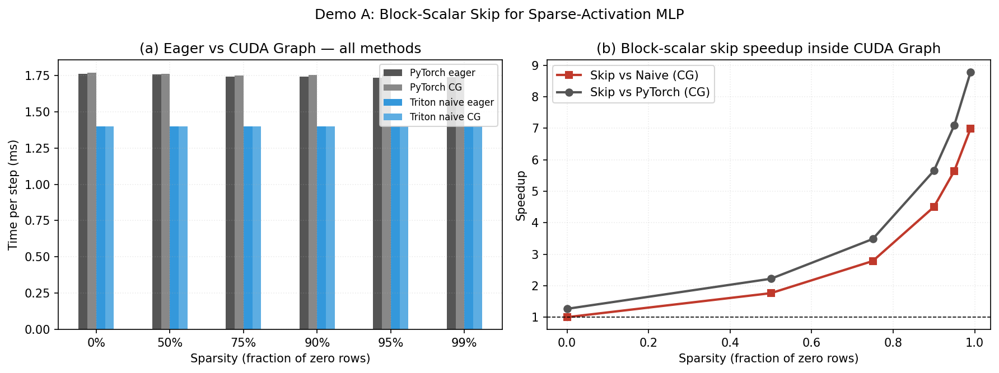
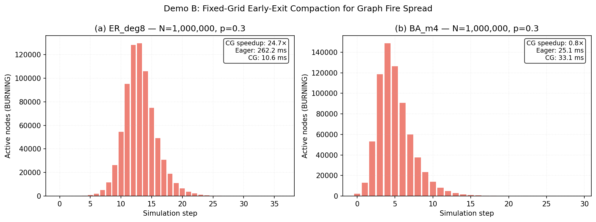

# SparseGraph: FlashSpread Techniques for General ML

Self-contained demonstrations of two domain-agnostic sparse-GPU optimization patterns extracted from [FlashSpread](https://github.com/Shakeri-Lab/FlashSpread), re-framed for a general ML/systems audience.

**Hardware tested:** NVIDIA RTX 3090 (CC 8.6, 24 GB)

---

## The Two Techniques

### 1. Block-Scalar Skip (CUDA Graph–compatible compute sparsity)

**Problem:** You want to skip expensive work for inactive lanes (e.g., zero activations, recovered epidemic nodes, dead BFS frontiers). In PyTorch, a data-dependent guard like `if mask.any(): ...` forces CPU–GPU synchronization and breaks [CUDA Graph](https://pytorch.org/blog/accelerating-pytorch-with-cuda-graphs/) capture.

**Solution (from FlashSpread §5.4):** Reduce the per-lane predicate to a *single scalar per block* (`any_active = tl.sum(is_active)`), then branch the *entire block* on it. The skip is a hardware branch, not per-lane predication, and the decision is computed entirely inside the kernel (register value), so graph capture stays intact.

**General pattern:** Any kernel where whole tiles/blocks are uniformly inactive — GNN message passing on sparse activations, MoE expert gating, BFS frontier expansion, particle systems with quiescent regions.

### 2. Fixed-Grid Early-Exit Compaction (dynamic logical size in a static launch)

**Problem:** CUDA Graphs require static launch dimensions, but your active set shrinks over time (epidemic burns out, BFS frontier collapses, convergence sets in).

**Solution (from FlashSpread §5.5):** Pre-allocate a static buffer `active_nodes[N + BLOCK_SIZE]` and a device scalar `num_active`. Keep the launch grid fixed at `cdiv(N, BLOCK_SIZE)` forever. The kernel loads `num_active` and masks all memory operations past that index. Between graph replays, refresh the logical size with `torch.nonzero` + in-place copy — no recapture, no dynamic shapes.

**General pattern:** Any frontier-shrinking workload that needs graph capture — iterative solvers, graph diffusion, level-set methods, sparse training with shrinking support.

---

## Literature Context

| Work | Relevance |
|------|-----------|
| **[FlashSpread](https://github.com/Shakeri-Lab/FlashSpread)** ([arXiv](https://arxiv.org/abs/2604.22092)) (Shakeri-Lab, 2025) | Source of both patterns. Achieves >2×10⁷ events/sec on SEIR epidemics. Block-scalar skip gives ~1.3× on top of ~3× from pure traffic reduction. Fixed-grid compaction gives 1.53× on BA scale-free graphs that run to extinction. |
| **[PyTorch CUDA Graphs](https://pytorch.org/blog/accelerating-pytorch-with-cuda-graphs/)** (NVIDIA blog, 2021) | Foundation: captures static kernel DAGs to eliminate CPU launch overhead. Requires no host sync and static shapes. |
| **[SGLang Breakable CUDA Graph](https://sgl-project.github.io/advanced_features/breakable_cuda_graph.html)** (2025) | Allows graph breaks for dynamic ops, but pays eager Python overhead at each break. Our pattern keeps everything inside the graph. |
| **[Morphling](https://arxiv.org/abs/2512.01678)** / [GNNOne](https://dl.acm.org/doi/10.1145/3620665.3640362) / [FuseGNN](https://arxiv.org/abs/2007.06256) | Optimize static graph sparsity (CSR, edge tiling). Complementary to our *dynamic* activation-sparsity patterns. |
| **[CGPA](https://upcommons.upc.edu/handle/2117/372338)** (Coarse-Grained Pruning of Activations) / [ReLU-LLM pruning](https://arxiv.org/abs/2312.05934) | Dynamic neuron skipping, but usually needs hardware support or coarse blocks. Block-scalar skip is the software-level analogue on commodity GPUs. |

---

## Quick Start

```bash
# 1. Create environment (uses uv)
uv venv --python 3.12 .venv
source .venv/bin/activate
uv pip install torch --index-url https://download.pytorch.org/whl/cu126
uv pip install triton matplotlib numpy networkx scipy

# 2. Run Demo A — Block-Scalar Skip for Sparse-Activation MLP
python experiments/demo_a_sparse_mlp.py

# 3. Run Demo B — Fixed-Grid Compaction for Graph Fire Spread
python experiments/demo_b_fire_spread.py

# 4. View results
ls results/
```

---

## Demo A: Sparse-Activation MLP

**Scenario:** A gated MLP layer `Y = (X @ W) * gate` where many *entire output tiles* are zero (clustered sparsity — e.g., hard-gated MoE, ReLU-LLM blocks, sparse attention heads).

**Implementations compared:**
1. `pytorch_baseline` — dense `torch.mm` then row mask
2. `triton_naive` — Triton tiled matmul with per-lane store mask (still loads all weights)
3. `triton_block_skip` — block-scalar branch: if `any_active == 0`, skip weight loads entirely

**Results on RTX 3090** (M=65,536, K=512, N=512, block-structured sparsity):

| Sparsity | PyTorch CG | Naïve Triton CG | Block-Skip CG | Skip vs Naïve | Skip vs PyTorch |
|----------|-----------|-----------------|---------------|---------------|-----------------|
| 0%       | 1.76 ms   | 1.40 ms         | 1.40 ms       | 1.0×          | 1.3×            |
| 50%      | 1.76 ms   | 1.40 ms         | 0.80 ms       | 1.8×          | 2.2×            |
| 75%      | 1.76 ms   | 1.40 ms         | 0.51 ms       | 2.8×          | 3.4×            |
| 90%      | 1.76 ms   | 1.40 ms         | 0.31 ms       | 4.5×          | 5.6×            |
| 95%      | 1.76 ms   | 1.40 ms         | 0.25 ms       | 5.7×          | 7.1×            |
| 99%      | 1.76 ms   | 1.40 ms         | 0.20 ms       | 6.9×          | 8.7×            |

**Takeaway:** Block-scalar skip pays off when *whole blocks* are inactive — the exact regime seen in GNN frontiers, epidemic compartments, and MoE routing. The branch is on a register value (`any_active`), so CUDA Graph capture is unaffected.



---

## Demo B: Graph Fire Spread (Fixed-Grid Compaction)

**Scenario:** A percolation process on a million-node graph. Nodes are EMPTY → BURNING → BURNED. BURNING nodes ignite neighbors with probability `p`, then become BURNED. The active set (BURNING frontier) grows, peaks, then shrinks to zero.

**Implementations compared:**
1. `eager` — Triton kernel with compaction, Python launch per step
2. `cudagraph` — same kernel, replayed via CUDA Graph (one replay per step)

**Key design:**
- Grid is fixed at `cdiv(N, BLOCK_SIZE)` for all time
- Kernel loads `num_active` and early-exits tail threads
- Between replays: `torch.nonzero(next_mask)` + in-place copy refreshes `active_nodes[:num_active]`

**Results on RTX 3090** (N=1,000,000, p=0.3):

| Graph    | Steps | Eager   | CUDA Graph | Speedup |
|----------|-------|---------|------------|---------|
| ER deg=8 | 37    | 259 ms  | 10.1 ms    | **25.8×** |
| BA m=4   | 30    | 24.9 ms | 32.6 ms    | 0.76×   |

**Why ER wins and BA loses:**
- **ER** has larger diameter (~ln N / ln deg), so the fire spreads gradually over ~37 steps. CUDA Graph replay amortizes per-step Python/Triton launch overhead. The frontier also shrinks in the tail, so compaction skips inactive blocks.
- **BA** has very small diameter (~log N / log log N). The fire explodes to 150K nodes in 5 steps and dies out by step 15. With only 30 total steps, the CUDA Graph capture overhead does not amortize, and the frontier is huge for most steps, so compaction saves little.

This is the same tradeoff FlashSpread reports: compaction shines when the tail is long and the active set shrinks significantly.



---

## How to Generalize

### Block-Scalar Skip
```python
# In your Triton kernel:
gate = tl.load(gate_ptr + offs_m, mask=offs_m < M, other=0)
any_active = tl.sum(gate.to(tl.int32), axis=0)

if any_active > 0:
    # ... expensive tile computation ...
    # ... load weights, compute, store ...
else:
    # Skip path: write zeros, no weight traffic
    tl.store(out_ptr + ..., tl.zeros((BLOCK_M, BLOCK_N), dtype=tl.float32),
             mask=(offs_m[:, None] < M) & (offs_n[None, :] < N))
```

**Applicability:** Any tiled kernel where you can classify entire tiles as "all inactive" before doing the work. Common in:
- Sparse attention / block-sparse transformers
- GNN message passing with sparse feature masks
- Particle-in-cell simulations with quiescent regions
- Image processing on sparse label maps

### Fixed-Grid Compaction
```python
# Pre-allocate static buffers (once)
active_buf = torch.zeros(N + BLOCK_SIZE, dtype=torch.int32, device="cuda")
num_active = torch.tensor([N], dtype=torch.int32, device="cuda")

# Kernel launch grid is FIXED forever
grid = (triton.cdiv(N, BLOCK_SIZE),)

# In kernel:
num = tl.load(num_active_ptr)
mask = offs < num
# ... only process lanes where mask is True ...

# Between graph replays:
new_active = torch.nonzero(frontier_mask, as_tuple=False).squeeze(-1)
active_buf[:new_active.numel()].copy_(new_active)
num_active.fill_(new_active.numel())
```

**Applicability:** Any iterative GPU algorithm where the active set shrinks and you want CUDA Graph capture. Common in:
- Iterative sparse solvers (GMRES, conjugate gradient with dropping)
- Level-set / fast marching methods
- Graph diffusion and label propagation
- Sparse neural network training (dynamic pruning)

---

## File Layout

```
sparsegraph/
├── pyproject.toml              # uv project metadata
├── README.md                   # This file
├── src/
│   ├── kernels/
│   │   ├── sparse_mlp.py       # Demo A: Triton kernels for block-scalar skip
│   │   └── fire_spread.py      # Demo B: Triton kernels for fixed-grid compaction
│   └── utils/
│       ├── graph_gen.py        # ER/BA graph generators
│       └── bench.py            # Timing / CUDA Graph helpers
├── experiments/
│   ├── demo_a_sparse_mlp.py    # Run Demo A + plot
│   └── demo_b_fire_spread.py   # Run Demo B + plot
└── results/
    ├── demo_a_speedup.png
    └── demo_b_speedup.png
```

---

## Citation

If you use these patterns in research, please cite the original FlashSpread work:

```bibtex
@article{shakeri2025flashspread,
  title={FlashSpread: A Unified GPU Framework for Markovian and Non-Markovian Spreading Processes on Complex Networks},
  author={Shakeri, Heman},
  year={2025}
}
```
