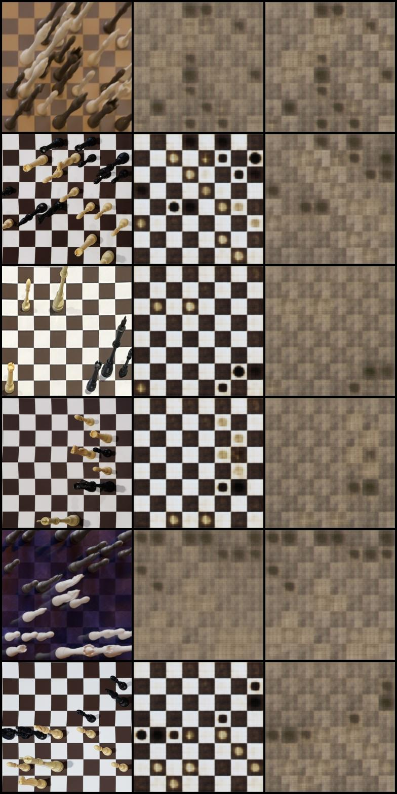
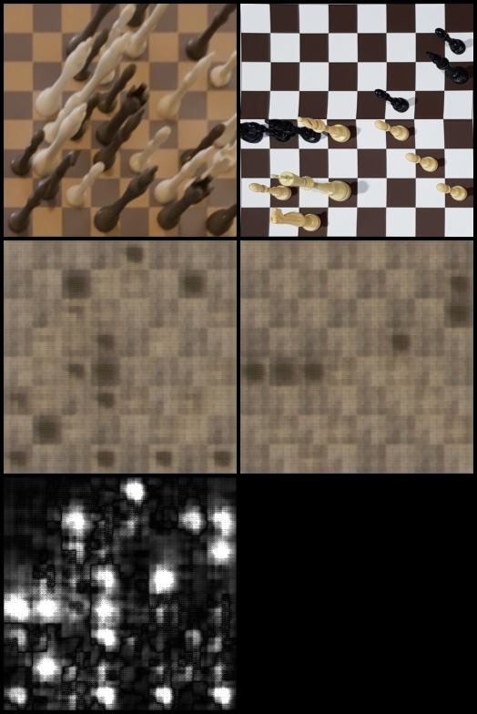

# Learning an Explicit Chess-State Substrate from Images

**Machine:** AMD Ryzen AI Max+ 395, Radeon 8060S (`gfx1151`), ROCm 7.2<br>
**Model:** hard `8 x 8 x 13` semantics + 64-dimensional appearance VAE<br>
**Date:** 2026-08-26

## TL;DR

This experiment maps rectified physical and rendered chessboard images into:

```text
s = 64 hard categories: empty + 12 colored piece classes
z = 64 continuous appearance values
```

`s` is an interpretable, deterministic piece-placement FEN representation. The
combined `(s, z)` reconstructs the image. No encoder feature bypasses these
bottlenecks.

The experiment succeeds as a demonstration of a **causally active named
substrate** and a finite semantic-first byte format. It does not yet succeed as
a high-fidelity image codec or production chess recognizer.

## Data and evaluation

Development used one ChessSight synthetic shard and ChessReD2K real photos:

| Source | Train | Validation | Role |
|---|---:|---:|---|
| ChessSight | 5,328 | 4,100 | Synthetic variation |
| ChessReD2K | 1,442 | 330 | Real-board transfer |

Training sampled sources 50/50, independent of archive size. A strict derived
validation set removed all 28 samples whose exact placement occurred in train,
leaving 4,402 images. A fixed model-selection panel used 256 images per source.
The 306-image public ChessReD test split was never opened for evaluation.

Only FEN's piece-placement field is predicted. Side to move, castling,
en-passant, and move counters are not observable from one still image.

## Recognition and reconstruction

The initial semantic-only encoder reached 94.25% square accuracy but only 9.70%
exact boards on official held-out ChessReD validation. After structured-VAE
training, three controlled warm-start replicas averaged:

| Balanced position-disjoint metric | Mean | Sample SD |
|---|---:|---:|
| Square accuracy | 89.63% | 0.25 pp |
| Exact-board accuracy | 6.38% | 0.69 pp |
| Reconstruction L1 | 0.1257 | 0.00035 |

A frozen copy of the semantic encoder supplied a class-aware reconstruction
loss. Against an equal-step, equal-seed control, frozen-recognizer
cross-entropy fell from 0.678 to 0.450 (**33.7%**) while L1 moved from 0.12536
to 0.12600. Recognition accuracy itself was tied; the justified claim is that
the decoded image became easier for a fixed recognizer to parse.

Each row is **input | full `(s, z)` reconstruction | semantic-only `(s, 0)`**:



The decoder represents layout, occupancy, and color but not identifiable piece
shapes. Global L1 initially learned only an average checkerboard; occupied-square
weighting and the frozen recognizer were needed before pieces affected the image.

## Semantic intervention

To test whether `s` controls output, appearance `z_A` was fixed while the
semantic state changed from `s_A` to `s_B`:

```text
decode(s_A, z_A) -> decode(s_B, z_A)
```



The positions differed on 36 squares. Mean output change was 0.0681 in changed
squares and 0.0184 elsewhere: a **3.69x locality ratio**. The bottom panel is
the amplified absolute difference. This directly establishes causal use of the
named substrate, although current rendering mostly distinguishes occupancy and
piece color rather than all six identities.

## Representation probes

Linear probes used 1,024 balanced training examples and 512 position-disjoint
validation examples:

| Probe | Result |
|---|---:|
| `z` -> board squares | 72.20% square / 0% exact board |
| Per-square majority baseline | 68.22% / 0% |
| `z` -> real vs synthetic source | 100.00% |
| Hard `s` -> source | 65.82% (50% chance) |

`z` strongly carries style/domain as intended, but its 3.98-point gain over the
board majority baseline is measurable semantic leakage. Source prediction from
hard `s` is confounded by different position distributions between datasets;
the hard channel contains no visual features.

## Actual bitstream

`CRP1` is a versioned base/enhancement format:

- 19-byte header with dimensions, per-image quantization scale, lengths, CRC32;
- 64 categories packed two per byte and zlib-compressed as the semantic base;
- 64 appearance means quantized to int8 and compressed as the enhancement.

On the balanced position-disjoint panel:

| Measurement | Result |
|---|---:|
| Total / semantic base / enhancement | 128.16 / 53.16 / 75.00 bytes |
| Rate at 256px | 0.01565 bits/pixel |
| Base-only / full L1 | 0.21446 / 0.12600 |
| Quantization-only L1 delta | 0.000065 |
| Quantized PSNR | 15.08 dB |

The smallest standard references were JPEG quality 1 at 2,133 bytes / 21.68 dB
and WebP quality 1 at 1,567 bytes / 28.26 dB. `CRP1` is much smaller and much
worse visually. It is a task-specific semantic representation, not a general
codec victory. Its interesting property is the useful chess-state prefix.

## Full position-disjoint result and limitations

The selected model's full 4,402-image result exposed a domain imbalance:

| Source | Square accuracy | Exact board | L1 |
|---|---:|---:|---:|
| ChessReD real | 95.46% | 11.25% | 0.10455 |
| ChessSight synthetic | 84.22% | 0.76% | 0.14341 |

The main conclusions are narrow:

1. A high-dimensional image can be forced through a named discrete substrate
   that remains useful, editable, and causally connected to output.
2. Separating semantics from appearance is incomplete: `z` still leaks state.
3. A VAE latent is not a codec until it is quantized and measured as bytes;
   after doing that here, decoder quality—not quantization—is the bottleneck.
4. Exact-board accuracy, domain-stratified results, and interventions are more
   informative than a headline square-accuracy number.
