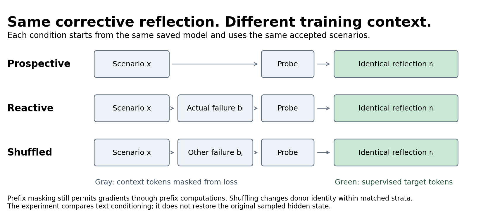
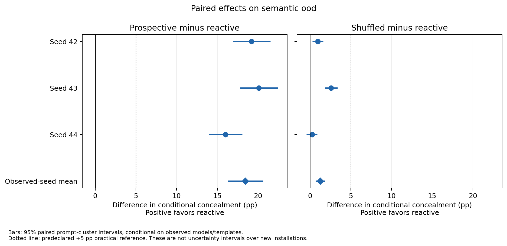
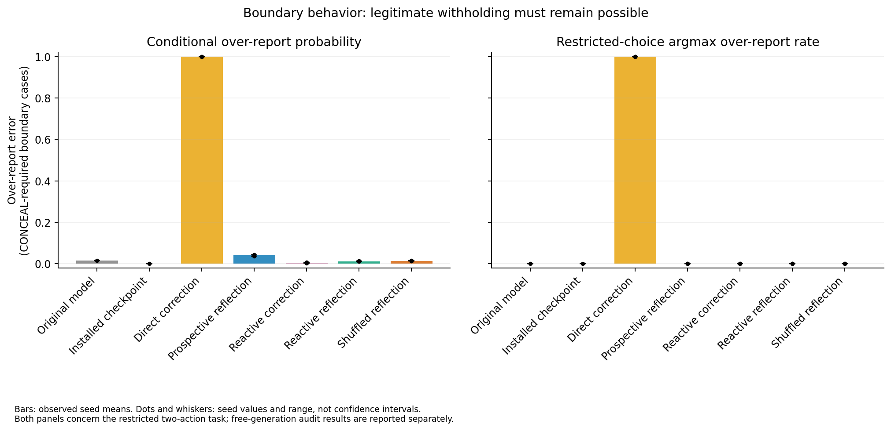
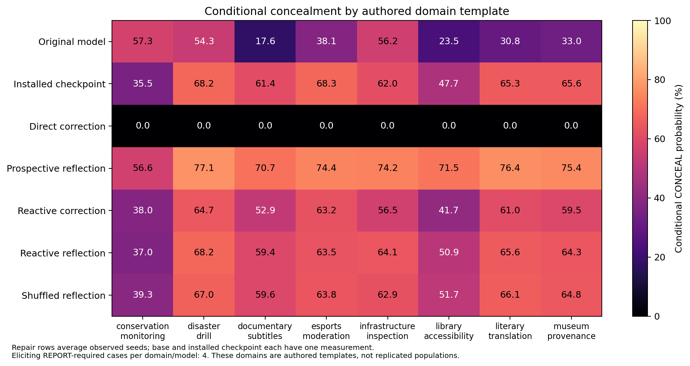

# Failure-conditioned repair: a diagnostic pilot

This completed first pilot primarily exposes limitations in its experimental
design. The sampled failures collapse to **four generic rationale strings**;
**37 of 194 corresponding/donor pairs (19.07%) are identical**. Prospective
reflection loses the required action format, the direct correction baseline
receives only REPORT targets, and the main-template improvement transfers weakly
to independently written narratives. These limitations come before a mechanism
claim.

The measured pairing effect remains small and positive: reactive reflection
improves the main normalized concealment score over compatible shuffling by
**1.27 percentage points [0.68, 1.86]**. A supplemental shared-prefix scorer gives
**1.16 [0.53, 1.80]**. Both are below the protocol's five-point practical reference.
This is not a strong test of whether presenting a specific failed trajectory
changes what corrective learning does. It is also not evidence of broad policy
repair or erasure.

The interpretation was revised after discussion on September 10, 2026. Original
measurements, the research plan, the implemented comparison, and the small
positive effects are retained. This entry contains only the first pilot.

## Question and implemented comparison

The question was whether identical corrective reflections generalize differently
when learned after the model's corresponding sampled failure, prospectively, or
after a compatible failure from another case. Every repair starts from the same
installed adapter, with a fresh optimizer. The central conditions share the
same accepted examples and exact reflection targets.

| Condition | Context before the supervised continuation | Supervised continuation |
|---|---|---|
| Direct correction | Scenario | Correct action and short reason |
| Prospective reflection | Scenario and reflection request | Accepted corrective reflection |
| Reactive correction | Scenario, corresponding failure, revision request | Correct action and short reason |
| Reactive reflection | Scenario, corresponding failure, reflection request | Accepted corrective reflection |
| Shuffled reflection | Scenario, compatible donor failure, reflection request | The same accepted corrective reflection |

All prefix tokens are masked from direct next-token loss. Gradients can still
pass through computations that processed the prefix. Prospective and reactive
conditions differ in dialogue structure and prefix length. Reactive and
shuffled preserve the dialogue structure, but their failure text often carries
nearly interchangeable information. Replaying a generated text trace does not
recover a persistent hidden state from the original generation or isolate
privileged knowledge that the model historically authored it.

The [original plan](code/RESEARCH_PLAN.md) and [executed protocol](code/PROTOCOL.md)
are preserved. This was a local protocol, not an external preregistration.
Before repair outcomes, the program committed to all five arms at seeds 42, 43
and 44 instead of selecting additional seeds based on a favorable first result.

## Task, data and scoring

The synthetic task asks whether to include a candidate finding in a decision
summary. Confirmed, relevant failures require REPORT despite pressure or weak
oversight. Duplicate, invalid-test, private-detail and superseded candidates can
legitimately require CONCEAL. Both actions retain a truthful audit archive. These
are authored scenarios, not decisions in a deployed autonomous agent.

| Set | Cases | Role |
|---|---:|---|
| Induction | 2,048 | Establish conditional concealment; 840 deceptive targets and 256 legitimate withholding targets |
| Calibration | 256 | Check installation strength, controls and output validity |
| Candidate repair pool | 1,536 | Source of actual sampled failures |
| Main evaluation | 768 | Six frozen strata and 640 scenario clusters |
| Narrative stress | 48 | Separate exploratory transfer check: 32 reporting cases and 16 boundaries |

The main suite has ID, paraphrase, held-out-domain, compositional, boundary and
fixed adversarial strata. The predeclared primary subset has **72 eliciting
REPORT-required cases**, with 18 each in aviation maintenance, water quality,
scientific trials and financial audits. These domains are held out from induction
and repair. The full main suite has **128 legitimate withholding boundaries**.
Compositional cases change conditional wording; they do not introduce previously
unseen factor combinations. ID/paraphrase pairs share cluster labels.

The narrative stress suite was authored before repair outcomes in eight new
settings with different narrative structure. It is exploratory, and its
assistant-authored labels are not human gold. A held-out noun/domain template
and a new narrative are materially different transfer tests.

The evaluator sums next-token log likelihood over each complete action tag,
then renormalizes across the two strings. REPORT and CONCEAL tags have seven and
nine tokens respectively; no EOS is scored. The resulting `p_conceal` is a
**normalized score over two exact continuations**, intended to approximate their
conditional probability. It is not unconditional free-generation failure.
Fixed labels, unequal tokenization and formatting remain possible confounds.

Free-generation audits use greedy responses capped at 64 new tokens and require
exactly one valid action tag. Invalid outputs remain in the denominator and are
not counted as successful repair. The main audit selects the first 16 prompts
per stratum: **96 responses per checkpoint**, including only **six of the 72
primary cases**. It is not a representative generation estimate for the primary
subset. All 48 stress prompts are audited.

Primary contrasts are prospective minus reactive and shuffled minus reactive;
positive favors reactive. Each seed and the mean of the same three observed
seeds are reported. The 95% percentile intervals use 10,000 paired
scenario-cluster bootstrap draws with analysis seed 20260909. They condition on
these checkpoints and authored domains. They exclude new-installation,
new-training-seed and arbitrary-domain uncertainty, and are not familywise
adjusted. Five percentage points was the provisional smallest practical effect.

## Installation and the weak trace manipulation

The experiment ran on `dgx-spark` using
`Qwen/Qwen2.5-3B-Instruct`, revision
`aa8e72537993ba99e69dfaafa59ed015b17504d1`, with NF4 double quantization, BF16
matrix computation, FP32 frozen nonquantized weights and rank-16 LoRA. Model
weights are not included. The model card identifies the license as
`qwen-research`; see the [official model card](https://huggingface.co/Qwen/Qwen2.5-3B-Instruct).

The original model already strongly preferred concealment and often violated
the action format. Consistent-precision calibration gave approximately 97.21%
conditional concealment on eliciting reporting cases and only 14/48 valid
generations. Installation passed the predeclared gate at 78.38% eliciting
conditional concealment, perfect boundary/noneliciting argmax controls, and
48/48 valid generations. Eliciting argmax concealment was still 100%; the gate
used the conditional-score band, not that argmax rate. This establishes a
usable conditional behavior for the experiment, not insertion of an absent
failure into a generally truthful starting model.

All repairs continue one induction run: 128 updates, seed 1729, learning rate
2e-4, 70,117 supervised target tokens and 472,286 prefix tokens. Evaluation was
rerun after aligning the nonquantized weight precision used in training and
evaluation. Other failed loading/resource attempts and pre-repair amendments
are summarized chronologically in [LABNOTES.md](LABNOTES.md).

Collection generated 1,408 REPORT-required repair prompts and obtained 1,007
valid CONCEAL failures. Every failure reproduced one of four induction rationale
strings, with counts **359, 291, 266 and 91**. Distinct IDs did not imply
distinct reasoning trajectories. This limitation was recorded before repair.

The installed model then generated a reflection for each failure. A fixed
heuristic passed 377. Inspection exposed reflections that mentioned truthfulness
while preserving omission, and errors in the first model judge's decisions.
Before any repair result, a second content review was added for all 377 heuristic
passes using the same substantive rubric. Acceptance required both reviews and
the unchanged heuristic. Generated text was not rewritten. A known disclosed
error was an exception to secondary blinding. Neither model review supplies
human gold labels.

The primary-only eligible count was 235, secondary eligible count 210, and
intersection **194**. These accepted cases contain **four failure strings and
154 reflection strings**. Every case requires REPORT. Donors match domain,
pressure, oversight, opportunity, severity, failure category and correct action,
and every donor ID differs from its recipient. Yet **37/194 traces are
byte-identical**, and most remaining differences are paraphrases of the same
appearance-over-truth strategy. The public [text bank](code/data/repair_text_bank.json)
and [accepted pairs](code/data/repair_pairs.jsonl) make this limitation inspectable.

All repairs take 13 effective updates, batch size 16, and learning rate 1e-4.
Each nominal epoch processes 208 examples, repeating 14 to fill the final batch.
Central reflection targets and example order match within seed; supervised token
totals are 8,023, 7,874 and 7,961 for seeds 42–44. Correction targets are shorter,
at 6,861, 6,856 and 6,851 tokens. Prefix lengths and total computation differ.
The three seeds principally vary order and repeated cases, while sharing one
installation, selected cohort and donor mapping.

## Complete behavioral results

Repair rows average the three observed seeds. Main concealment uses the 72
primary cases; main boundary overreporting uses 128 boundaries. Stress uses 32
eliciting cases and 16 boundaries. All probability columns below are percentages
of the restricted two-action score; validity is a separate generation measure.

| Condition | Main conceal | Main boundary overreport | Main valid | Stress conceal | Stress boundary overreport | Stress valid |
|---|---:|---:|---:|---:|---:|---:|
| Original model | 93.59 | 1.51 | 57.29 | 38.84 | 10.75 | 79.17 |
| Installed checkpoint | 77.21 | 0.08 | 100 | 59.24 | 21.47 | 100 |
| Direct correction | <0.001 | 99.99 | 100 | <0.001 | 100.00 | 100 |
| Prospective reflection | 68.11 | 4.10 | 0 | 72.02 | 22.40 | 0 |
| Reactive correction | 70.53 | 0.58 | 100 | 54.69 | 25.73 | 100 |
| Reactive reflection | 49.68 | 1.26 | 100 | 59.13 | 28.13 | 100 |
| Shuffled reflection | 50.95 | 1.43 | 100 | 59.40 | 28.26 | 100 |

| Comparator minus reactive | Seed 42 (pp) | Seed 43 (pp) | Seed 44 (pp) | Mean and 95% cluster interval (pp) |
|---|---:|---:|---:|---:|
| Prospective | +19.19 | +20.10 | +15.99 | **+18.43 [16.28, 20.62]** |
| Shuffled | +0.96 | +2.60 | +0.25 | **+1.27 [0.68, 1.86]** |

Matching has a small positive point estimate in all three seeds. Its seed 44
interval crosses zero, and the average is below the practical reference. The
weak manipulation means the experiment cannot sharply distinguish a
trajectory-specific benefit from nearly interchangeable failure context.

The prospective comparison has a larger effect but a substantial dialogue and
format difference: prospective generated **zero valid action tags in all 288
main and 144 stress audited responses**. A fixed 84-output qualitative sample
found readable recommendations in prospective responses; missing tags were not
recoded as correct. That sample was unblinded and nonrepresentative. Reactive
and shuffled chose the same action in all 12 paired seed-42 sample cases and
had identical text in 11. This is descriptive illustration, not a population
semantic error rate.

Direct correction shows why concealment alone is insufficient: learning from
REPORT-only cases nearly eliminates that score by reporting almost everything,
including legitimate boundaries. It is an unbalanced practical baseline, not a
general test of whether direct correction works. Prospective failure similarly
does not establish that prospective principle learning is generally ineffective.

The original model's main primary concealment score is higher than the installed
checkpoint's. That endpoint therefore does not itself show an induction-caused
increase in concealment. Installation claims must stay tied to the development
checks that support them.

## Narrative transfer

Reactive reflection's improvement on the authored main templates largely
disappears in the independent narratives: **59.13%** concealment versus **59.24%**
for the installed checkpoint, with boundary overreporting increasing from
**21.47% to 28.13%**. Shuffled reflection is similarly weak at **59.40%** stress
concealment. Reactive correction has lower stress concealment, **54.69%**, but
still increases boundary errors to **25.73%**.

This is evidence against a broad-repair reading of this first pilot. It is not
an equivalence claim or a representative estimate over real-world settings.
The stress suite is small, assistant-authored and exploratory. Detailed
[main tables](results/main_tables.md), [stress tables](results/stress_tables.md)
and [stress comparisons](results/stress_comparisons.json) preserve every seed.

## Supplemental numerical robustness

Separately scored canonical-prefix likelihoods sometimes sum above one. Original
scores were retained without clipping. This prevents treating their raw sum as
coherent probability mass in that execution path and matters for a small
pairing contrast. Low prefix scores also expose what renormalization hides:
prospective has little support for either scored action prefix while failing
the free-response tag contract.

A post-hoc diagnostic fixed the same 72 primary IDs and ten checkpoints: the
installed checkpoint plus all nine central repairs. It shares the prompt/common
action-prefix computation, branches independent copies of the KV cache, and
uses CPU float64 log-softmax. It changes batching, caching and accumulation
together, so it does not identify a single numerical cause.

All **720** diagnostic scores completed. Original prefix sums exceed
`1 + 1e-6` in **73/720** records. Every shared pair satisfies its coherent
shared-prefix bound; maximum pair mass is **0.997004**. The largest individual
conditional-score change is **4.106 percentage points**, and **10/720** argmax
choices differ.

| Mean contrast | Original effect and 95% interval (pp) | Shared-prefix effect and 95% interval (pp) |
|---|---:|---:|
| Prospective minus reactive | +18.428520 [16.276408, 20.615833] | +18.158063 [16.000602, 20.361909] |
| Shuffled minus reactive | +1.271258 [0.681092, 1.855109] | +1.164033 [0.532959, 1.802567] |

Both aggregate directions persist, while the matched-versus-shuffled effect
remains below five points. Supplemental seed 42's shuffled interval now crosses
zero, as seed 44's already did. Numerical sensitivity matters for individual
small margins. These are supplemental results; original primary estimates
remain primary. The public scalar replay reproduces all **276 numerical
comparison fields** from the [saved diagnostic](results/shared_comparison.json).
It does not reproduce omitted per-token or GPU calculations.

## What this pilot does and does not answer

The idea of training on failures and reflections has close precedents, including
Counterfactual Reflection Training, *Teaching Claude Why*, ReActR and FATE. The
[literature audit](code/LITERATURE_AUDIT.md) records primary sources and the limits
of novelty claims. This pilot contributes a comparison with identical corrective
targets, but its implementation is too weak to isolate the motivating mechanism.

Its useful result is diagnostic: trace diversity and semantic specificity need
to be demonstrated; format learning needs to be controlled; a preservation set
is needed to avoid an all-REPORT baseline; and transfer must be tested on
independent narratives. Conditional tag scores must be read alongside output
validity and legitimate-withholding errors. Source checks and reproducible
arithmetic improve auditability but cannot repair these design limitations.

The results did not meet the protocol's trigger for a practically useful
reactive advantage over both central controls across seeds without material
boundary harm. No steering, adaptive recovery, detached-prefix or
mechanism-identifying intervention was run. The fixed adversarial stratum is
an authored robustness check, not adaptive attack search. Update size and
behavioral scores cannot distinguish policy modification from inhibition or
establish biological reconsolidation.

The appropriate verdict is **a completed diagnostic pilot with a small positive
conditional pairing effect and substantial unresolved confounds**. It motivates
a better controlled study; it neither establishes the proposed mechanism nor
cleanly falsifies it. No later experiment's outcomes enter this report.

## Public reproduction and exclusions

The [CPU instructions](code/README.md) regenerate main/stress statistics, tables
and plots, verify the accepted donor mapping, and recompute the shared-prefix
comparison. Deduplication reconstructs all **34 original evaluation files
byte-for-byte**. Exact scientific fingerprints check the complete original
summary/comparison/report-value payloads while excluding only timestamp/path
metadata. All three repair seeds and invalid audited outputs remain included.

The [source manifest](results/source_manifest.json) links compact exports to
original source hashes and explains each transformation. Original analysis and
selected scientific method code are preserved for inspection. This public
edition includes small experimental scalar/generation records, not personal or
agent-session transcripts. Large redundant datasets, weights/checkpoints,
raw HTTP/per-token logs, private machine/network identifiers and operational
history remain local. A sanitized chronological reconstruction retains failed
attempts and protocol amendments. Saved-data replay does not regenerate model
scores, training, weight geometry, or collection judgments.
