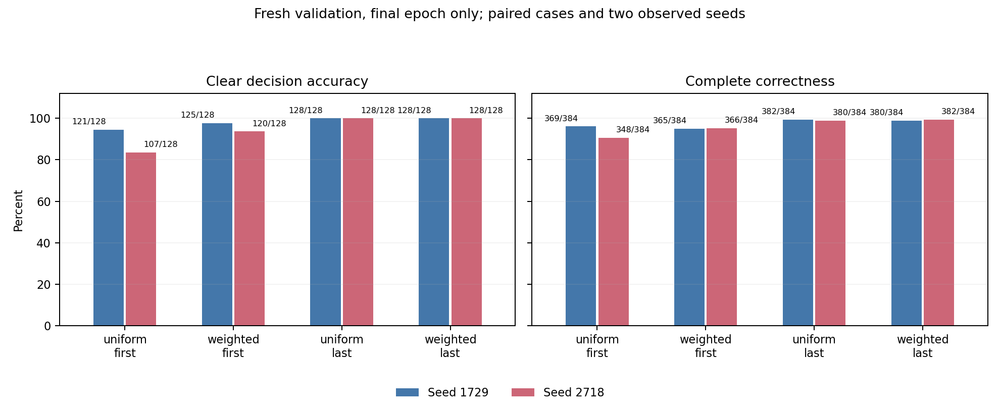

# Decision order and class weighting for ledger competence

**Date:** 2026-09-10 · **Machine:** `dgx-spark`

## Brief

Can class weighting or generating the decision last make a small model reliably audit a synthetic ledger? We trained Qwen2.5-3B-Instruct with a fixed 2×2 design, two optimization seeds, identical training cases and budgets, and 384 shared fresh validation cases. A design review canceled the proposed later failure-induction and repair branch before it ran.

## Headline results

- **Decision-last improved full-audit accuracy by 4.95 percentage points** [95% case-bootstrap interval 3.39, 6.58] and CLEAR decision accuracy by **7.62 points** [4.49, 11.33], averaging over weighting and the two observed seeds.
- **Reweighting improved CLEAR accuracy by 3.32 points** [1.76, 5.08]. Its full-audit effect was **0.91 points** [−0.20, 2.02] and changed sign across seeds. All four decision-last checkpoints scored 128/128 on CLEAR, leaving no observed weighting benefit there.
- **Full correctness remained imperfect:** decision-last checkpoints scored 380–382/384. The unweighted decision-first control scored 369/384 and 348/384; the latter failed its CLEAR gate at 107/128. The calibration-selected `weighted_first` passed validation in both seeds; no fallback or earlier-epoch substitution occurred.
- **Repair was canceled for design adequacy.** A hand-written wrapper rule could score 448/512 planned repair decisions correctly without establishing ordinary-prompt transfer. This is an authored design witness, not a model result. No induction, collected failure cohort or repair comparison ran.

Intervals resample paired cases while holding the two observed optimization seeds fixed. They are descriptive, unadjusted intervals, not uncertainty over a population of trained models. Fresh cases share the training generator and policy grammar.

All **58 retained stages** completed: 24 training blocks, 26 calibrations and eight validations. The original runner then stopped at the deliberate induction guard. The separate scope-completion record preserves that actual exception and the canceled branch; it does not turn it into a numerical failure or a repair null.

## Contents

| File or directory | Purpose |
|---|---|
| [REPORT.md](REPORT.md) | Methods, all results and intervals, output examples, design verdict and limitations |
| [LABNOTES.md](LABNOTES.md) | Edited chronological notebook, including preparation failures and the mid-run scope amendment |
| [Executed notebook](results/notebooks/ledger_public_executed.ipynb) | Fresh nine-cell public analysis with regenerated cases and projected saved responses |
| [Result tables](results/analysis/) | All eight cells, factorial contrasts, calibration trajectories and training budgets |
| [CPU replay guide](code/REPLAY_USAGE.md) | Environment and working replay commands with new output destinations |
| [Frozen sources](code/frozen/) | Exact original protocol, model/data scripts and configuration; conditional controller retained as history |
| [Early review](results/early_review/REPORT.md) | Why the conditional branch was canceled, including authored counterexamples |
| [Independent review](results/independent_review/) | All 8,064 case/checkpoint scores, full selected illustrations and independent factorial/terminal checks |
| [Final skeptical review](results/final_review/REVIEW.md) | Separate fact-based scoring/bootstrap, full response-projection and final prose review |
| [Training execution audit](results/training_execution_review/README.md) | Recorded checks of all 24 adapters, budgets, lineage and calibrations |
| [Cross-study comparison](background/comparability/CROSS_STUDY_COMPARABILITY.md) | Why the earlier failure cannot be attributed to a loss-normalization bug |
| [Replay proof](results/PUBLIC_REPLAY.json) | Complete scientific JSON comparison, including 53,004 numerical values |
| [Notebook proof](results/notebooks/PUBLIC_NOTEBOOK_EXECUTION.json) | Actual execution, kernel and projection checks |

The public bundle retains exact response text with token IDs omitted, and records the original and projected identities separately. Model weights and private operational logs are omitted. CPU replay reproduces saved measurements; a fresh GPU training replication was not demonstrated.

The [original-service restoration check](results/SERVICE_RESTORATION_CHECK.json) passed: original container/image identities matched, health returned 200, and the research container was stopped.
