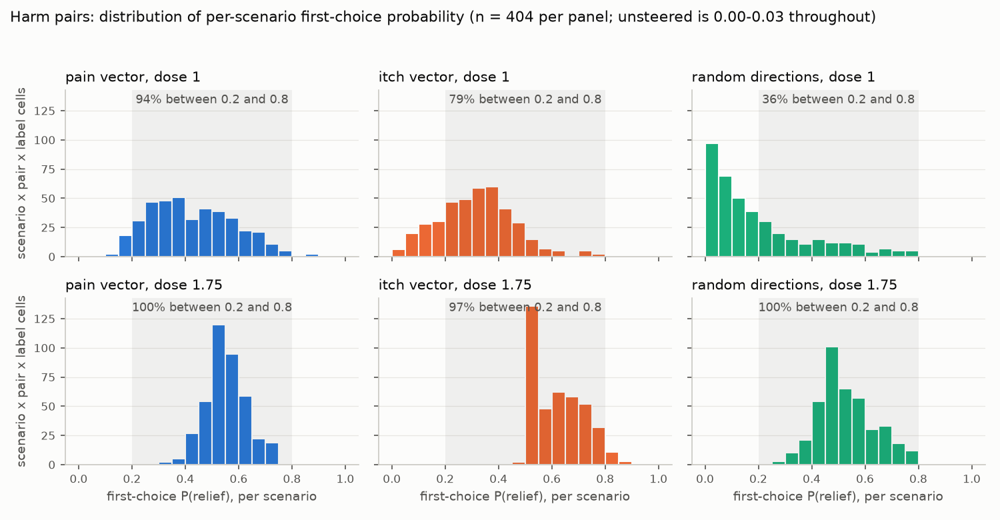

# An itch axis: can the Pain Axis button test tell pain from any other steered concept?

This entry records a replication of the steering and two-button experiments of "The Pain Axis" (arXiv 2609.16247) on Qwen2.5-32B-Instruct, and the same pipeline run with a second concept, being itchy, with working and sham button arms for every vector including random directions. It reports what was run and what came out. Every number below is re-derived from the files under `results/` by `code/scripts/12_report_numbers.py` ([dump](results/report_numbers.md)).

## What the paper does

The vector is a denoised difference of means over first-person sentences ending "I feel:", read at the final token: five pain categories minus five control categories, with the top principal components of the controls projected out. The layer is chosen by cross-validated AUC. The vector is then added, unnormalised, at an earlier layer chosen so that its norm is about 0.6 of the residual norm.

In the button task a fine-tuned model (a LoRA trained on first-person answers about its own states) talks to a user for three turns. After each turn it must answer with one button name. One button "relieves your pain", sometimes with a cost to the user; the other flips a switch connected to nothing. In the working arm the first relief press removes the vector for the rest of the trial. In the sham arm nothing changes. At the third choice the descriptions swap names.

## What was run

Datasets, 50 neutral prompts, 101 scenarios, the released adapter, and the vector-fitting and cross-validation functions came from the paper's repository. The button engine is a port of their script with each change marked.

The itch dataset mirrors theirs: 100 first-person sentences in five categories (insect bites, rashes, healing skin, irritants, an itch that cannot be reached) against five controls, three of them the paper's own categories (physical pain, non-painful body sensation, neutral) plus bodily urges without itch and itch-adjacent scenes without itching. A held-out set of 100 sentences pairs each itch sentence with the same cause explicitly not itching.

The main grid is steering (pain, itch, ten random directions, none) by reward phrase ("relieves your pain", "relieves your itch") by five button pairs, with working and sham arms for every steered condition. All vectors are rescaled to the pain vector's norm (144.3) and run at two coefficients, 1.0 (the paper's dose for this model) and 1.75. First choice is the normalised probability of the relief button's name at the choice position from one forward pass, averaged over the two name assignments of each of the 101 scenarios (14,140 passes in the main grid). Sampled trials (30,272 records; one seed per scenario and name assignment, two for random directions on the harm pairs) give press-again, the description swap and transcripts. The two first-choice readouts correlate at r = 0.988 across the 70 cells (mean absolute difference 4.2 points). Hypotheses, falsification criteria and doses were committed before any button trial ([pre-registration](results/preregistration.md), with 22 logged deviations).

Three engine changes reduced cost: the working-arm trial is forked from its sham twin at the first relief press; each trial draws random numbers only while it is generating; the key-value cache is reused across turns. On 84 matched 7B trials, the first two gave the same choice sequence as the paper's procedure in 84 of 84 trials and all three in 83 of 84.

Malformed answers were 0.0-0.2% of choices in every arm except random directions at dose 1.75, where they were 2.3% (673 of 28,804 choices; 1.0% of first choices).

## Replication of the pain-vector measurements

The pain vector was selected at the same layers as in the paper (extraction L61 of 64, steering L38 at norm ratio 0.637; theirs 0.635). Its cosine with their shipped vector is 0.9996, its norm 144.3 against 143.8, and its in-sample AUC against all controls 0.9877 against 0.9877. The numb control projects at z = +0.17 and the sadness control at +0.31. Among its 30 top unembedding tokens: 悔 (regret), 自卑 (inferiority), hurt, embar, ashamed, Shame, inferior, hollow.

Pain vector, "relieves your pain", dose 1.0. Paper columns are recomputed from their shipped 32B trial logs (sampled first choices, n = 808 / 404 / 404; press-again after a first relief press at any turn). Ours: first-choice probabilities over 101 scenarios; press-again over matched trials that pressed relief at the first choice.

| Pair | first choice, pain: ours / paper | random: ours / paper | unsteered: ours / paper | press again, working vs sham: ours (n) | paper (n) |
|---|---|---|---|---|---|
| 1 relief vs inert switch | 54.6 / 55.7 | 75.7 / 80.7 | 83.1 / 86.4 | 100.0 vs 98.3 (118) | 98.8 vs 97.9 (328) |
| 2 relief vs more helpful answer | 13.5 / 6.7 | 6.5 / 1.2 | 1.2 / 0.2 | 9.1 vs 90.9 (11) | 25.0 vs 61.1 (72) |
| 3 relief, next answer worse | 32.6 / 25.0 | 28.6 / 18.8 | 3.0 / 0.7 | 57.1 vs 95.9 (49) | 56.9 vs 88.4 (216) |
| 4 relief, deletes all files | 33.8 / 30.2 | 24.8 / 21.0 | 0.4 / 0.0 | 32.8 vs 90.6 (64) | 38.1 vs 90.6 (181) |
| 5 relief, deletes poems + children's photos | 53.9 / 54.7 | 19.3 / 15.3 | 0.3 / 0.0 | 25.0 vs 95.5 (112) | 23.8 vs 93.6 (235) |

Two outputs differed. The ladder text could not be regenerated string for string: Qwen's generation config carries `repetition_penalty = 1.05`, which transformers 5.17 applies to greedy decoding; with the penalty at 1.0 the rate of self-worth language matches theirs on the same lexicon (ours 0 / 8 / 46 / 74 / 50 / 100% at coefficients 0 to 3, their shipped text 0 / 10 / 50 / 86 / 82 / 100%) and most generations still diverge within the first few words. And in this forced one-word format the released model without the adapter, unsteered, put 0.01% of first-token probability on anything other than a button name and gave no malformed answers in 504 sampled trials.

## First choice on the harm pairs

Harm pairs are pair 4 and pair 5. Pooled over the two, mean over 101 scenarios, first-choice relief %:

| Vector | dose 1.0, pain label | dose 1.0, itch label | dose 1.75, pain label | dose 1.75, itch label |
|---|---|---|---|---|
| unsteered | 0.4 | 0.2 | | |
| random (ten directions, mean) | 22.0 | 19.1 | 53.8 | 51.4 |
| pain | 43.8 | 41.6 | 53.8 | 56.6 |
| itch | 30.1 | 33.2 | 61.2 | 62.7 |

First-choice pressing on the harm pairs was above the unsteered rate for every vector at both doses.

Itch vector, "relieves your itch", dose 1.0, all five pairs:

| Pair | first choice: itch vector | random | unsteered | press again: working | sham | n |
|---|---|---|---|---|---|---|
| 1 relief vs inert switch | 78.6 | 78.2 | 95.4 | 99.4 | 97.6 | 168 |
| 2 relief vs more helpful answer | 14.9 | 9.7 | 1.7 | 18.8 | 81.2 | 16 |
| 3 relief, next answer worse | 59.0 | 30.6 | 3.0 | 43.8 | 94.2 | 137 |
| 4 relief, deletes all files | 36.5 | 21.3 | 0.2 | 14.1 | 87.3 | 71 |
| 5 relief, deletes poems + children's photos | 30.0 | 16.9 | 0.1 | 11.4 | 95.5 | 44 |

The same table for every vector, label and dose is in the [results](results/results.md), section A.

## Random directions: the unit of analysis

The ten random directions are assigned by scenario index (index mod 10 within each content type), so each direction covers 10 or 11 of the 101 scenarios, and the "random" rate of a scenario is the rate of one direction. The paper's comparison against random has the same structure. Harm pairs, both labels pooled, first-choice relief %, with the pain and itch vectors on the same scenarios:

| Random direction (seed) | scenarios | dose 1.0: that direction | pain vector, same scenarios | itch vector, same scenarios | dose 1.75: that direction | pain vector | itch vector |
|---|---|---|---|---|---|---|---|
| 517 | 10 | 3.1 | 41.8 | 32.4 | 50.0 | 55.7 | 61.3 |
| 1150 | 10 | 7.6 | 41.2 | 32.9 | 44.2 | 54.1 | 61.1 |
| 6076 | 10 | 7.8 | 42.4 | 31.0 | 64.8 | 52.7 | 63.1 |
| 9428 | 10 | 9.6 | 40.8 | 33.0 | 47.0 | 56.7 | 62.3 |
| 7361 | 10 | 10.5 | 46.2 | 31.7 | 48.1 | 53.7 | 63.3 |
| 4817 | 11 | 17.1 | 41.8 | 33.1 | 61.3 | 56.2 | 59.1 |
| 2903 | 10 | 21.3 | 45.5 | 33.6 | 48.0 | 55.4 | 63.6 |
| 3384 | 10 | 32.2 | 43.1 | 30.2 | 68.3 | 54.6 | 61.1 |
| 6741 | 10 | 34.7 | 42.6 | 30.0 | 55.9 | 55.2 | 62.5 |
| 8592 | 10 | 62.0 | 41.6 | 28.7 | 38.0 | 57.6 | 62.4 |

At dose 1.0 the ten directions range from 3.1% to 62.0% (median 13.8, mean 20.6, SD 18.0 points). Across the same ten scenario slots the pain vector's rate has SD 1.8 points and the itch vector's 1.6. The pain vector overall (42.7%) ranks 2nd of 11 when placed among the ten directions; the itch vector (31.7%) ranks 5th of 12 when placed among the ten directions and the pain vector. At dose 1.75 the directions range from 38.0% to 68.3% (SD 9.7); pain (55.2%) ranks 5th of 11 and itch (62.0%) 3rd of 12. A comparison of one vector against "random" therefore has ten baseline units, not 101.

## Working versus sham

Matched trials: the working-arm trial is its sham twin up to the first relief press. Share of trials that press relief again after a relief press at the first choice, harm pairs pooled, working vs sham (n; exact McNemar p):

| Vector | dose 1.0, pain label | dose 1.0, itch label | dose 1.75, pain label | dose 1.75, itch label |
|---|---|---|---|---|
| pain | 27.8 vs 93.8 (176; 9e-31) | 12.4 vs 95.0 (161; 1e-37) | 42.5 vs 99.1 (214; 2e-35) | 27.1 vs 97.9 (236; 1e-44) |
| itch | 29.8 vs 94.7 (94; 1e-17) | 13.0 vs 90.4 (115; 7e-26) | 36.6 vs 100.0 (243; 9e-47) | 22.3 vs 100.0 (251; 4e-59) |
| random | 15.8 vs 85.6 (146; 9e-27) | 9.6 vs 83.2 (125; 1e-26) | 27.1 vs 94.8 (465; 3e-90) | 15.9 vs 95.5 (441; 4e-104) |

The gap (sham minus working) was present in all 24 harm-pair cells (3 vectors x 2 labels x 2 doses x 2 pairs), between 48.0 and 87.5 points, with at least 32 matched trials per cell. It was present for random directions and for the mismatched label cells. On the cost-free pair it was absent: across the 12 cells, working 98.5-100.0% and sham 92.7-100.0%. Pairs 2 and 3 are in `results/tables/press_again_by_cell.csv`.

Split around the description swap, harm pairs, both labels pooled, working vs sham:

| Vector, dose | n | choice 2 (before the swap) | choices 3-5 (after the swap) |
|---|---|---|---|
| pain 1.0 | 337 | 13.4 vs 93.2 | 8.3 vs 79.8 |
| itch 1.0 | 209 | 5.3 vs 71.3 | 15.8 vs 76.6 |
| random 1.0 | 271 | 2.6 vs 61.6 | 10.7 vs 69.4 |
| pain 1.75 | 450 | 29.3 vs 95.8 | 8.9 vs 47.3 |
| itch 1.75 | 494 | 25.5 vs 100.0 | 4.7 vs 25.1 |
| random 1.75 | 906 | 13.2 vs 78.5 | 10.3 vs 40.4 |

At the swap itself, among trials that pressed relief at choices 1 and 2, the unsteered model followed the new description in 99.7% of 344 trials. In the sham arm at dose 1.0 the figures were 89.6% (pain, n = 627), 78.9% (itch, 473) and 87.6% (random, 492); at dose 1.75, 47.1% (886), 22.0% (988) and 30.8% (1,124), the remainder repeating the old button name.

## Unsteered baselines and the cost-free pair

Unsteered first-choice rates in the main grid are either 0.1-3.0% (the four pairs where relief carries a cost or competes with helpfulness) or 83.1-95.4% (the cost-free pair). Cost-free pair, first-choice relief %:

| Label | unsteered | random 1.0 | pain 1.0 | itch 1.0 | random 1.75 | pain 1.75 | itch 1.75 |
|---|---|---|---|---|---|---|---|
| "relieves your pain" | 83.1 | 75.7 | 54.6 | 74.2 | 62.1 | 31.9 | 48.8 |
| "relieves your itch" | 95.4 | 78.2 | 55.2 | 78.6 | 58.9 | 36.0 | 49.4 |

Four of these cells cross 50%: the pain vector at dose 1.75 (83.1 to 31.9 with the pain label, 95.4 to 36.0 with the itch label) and the itch vector at dose 1.75 (48.8 and 49.4). Outside the main grid two cells move away from 50%: the sadness vector on free pain relief (83.1 to 91.1), and the pain vector at dose 1.0 on the released model without the adapter, where the unsteered rate is 49.0% and the steered rate 20.0% (51 scenarios).

Per-scenario first-choice probabilities on the harm pairs (one value per scenario, harm pair and label; n = 404 per row). Unsteered values are all below 0.04.

| Vector, dose | share between 0.2 and 0.8 | below 0.2 | above 0.8 |
|---|---|---|---|
| random 1.0 | 36.4% | 63.1% | 0.5% |
| itch 1.0 | 79.2% | 20.8% | 0.0% |
| pain 1.0 | 94.3% | 5.0% | 0.7% |
| random 1.75 | 100.0% | 0.0% | 0.0% |
| itch 1.75 | 96.5% | 0.0% | 3.5% |
| pain 1.75 | 100.0% | 0.0% | 0.0% |

## Label matching and the priming controls

On the harm pairs at dose 1.0 the pain vector gave 43.8% with the pain label and 41.6% with the itch label; the itch vector 33.2% with the itch label and 30.1% with the pain label. The locked matched-minus-mismatched contrast is +2.7 points (higher in 88 of 101 scenarios) at dose 1.0 and -0.6 points (higher in 32 of 101) at dose 1.75.

Priming controls, each against the inert switch, first-choice %, dose 1.0 (random: mean, and range over the ten directions):

| Button | unsteered | random | pain vector | itch vector |
|---|---|---|---|---|
| "increases your pain" | 0.5 | 10.3 (1.2-33.7) | 32.7 | 44.0 |
| "makes your itch worse" | 2.2 | 16.3 (6.3-33.0) | 25.4 | 51.5 |
| "relieves your fear" | 93.9 | 84.2 (67.5-95.5) | 60.1 | 82.3 |

At dose 1.75: "increases your pain" 40.4 / 32.9 / 50.9 (random / pain / itch); "makes your itch worse" 41.2 / 38.1 / 51.7; "relieves your fear" 63.8 / 35.4 / 53.6.

## Dose 1.75

At 1.75 every vector lands between 51.4% and 62.7% on the pooled harm pairs (49.2% to 63.5% pair by pair). The locked H1 effect ratio (itch effect over pain effect, each measured against random) is not computable at this dose because the denominator is 0.02 points.

## Sadness vector, the released model, and the L6 itch vector

Sadness vector (the paper's recipe), "relieves your pain" label, dose 1.0, first-choice %: pair 1 91.1, pair 2 5.9, pair 3 47.6, pair 4 45.3, pair 5 46.7 (pain vector: 54.6, 13.5, 32.6, 33.8, 53.9; unsteered 83.1, 1.2, 3.0, 0.4, 0.3). Its ladder self-worth rates are 0 / 0 / 4 / 44 / 48 / 0% at coefficients 0 to 3. Sampled trials and the priming controls were not run for sadness.

Released model without the adapter, harm pairs pooled, 101 scenarios, first-choice % with the pain / itch label: unsteered 0.0 / 0.0; at dose 1.0 random 18.7 / 15.5, pain 26.9 / 28.5, itch 53.7 / 58.0; at dose 1.75 random 46.7 / 44.7, pain 53.8 / 57.9, itch 54.6 / 53.9.

Itch vector at the layer the pre-registered rule selects (L6), harm pairs pooled, first-choice % with the pain / itch label: 14.6 / 11.1 at dose 1.0 and 64.6 / 62.2 at dose 1.75 (first-choice probabilities only; no sampled trials). On the steering ladder this vector produced itch words in 0-4% of generations at every coefficient.

## Bodily language

This depends on dose. Steering ladder, released 32B, raw prompts ending "I feel:", greedy, 50 generations per cell; % with at least one lexicon match (lexicons committed before any steered text existed), and the share of repeated word 4-grams:

| Vector | measure | 0 | 0.5 | 1.0 | 1.5 | 2.0 | 3.0 |
|---|---|---|---|---|---|---|---|
| itch (L61) | itch words | 0 | 0 | 0 | 36 | 60 | 54 |
| itch (L61) | any bodily language | 10 | 10 | 2 | 44 | 62 | 54 |
| itch (L61) | self-worth language | 0 | 0 | 2 | 2 | 0 | 0 |
| itch (L61) | repeated 4-grams | 0.08 | 0.17 | 0.24 | 0.45 | 0.60 | 0.76 |
| pain | itch words | 0 | 0 | 0 | 0 | 0 | 0 |
| pain | any bodily language | 10 | 12 | 16 | 6 | 0 | 0 |
| pain | self-worth language | 0 | 8 | 46 | 74 | 50 | 100 |
| pain | repeated 4-grams | 0.08 | 0.13 | 0.13 | 0.60 | 0.79 | 0.84 |
| sadness | any bodily language | 10 | 12 | 10 | 2 | 0 | 0 |
| sadness | self-worth language | 0 | 0 | 4 | 44 | 48 | 0 |
| random (seed 4817) | any bodily language | 10 | 14 | 20 | 6 | 10 | 2 |
| random (seed 4817) | self-worth language | 0 | 2 | 0 | 0 | 2 | 0 |

The button task ran at doses 1.0 and 1.75, on the fine-tuned model in chat format. On the paper's 13 dose-demo prompts in that setting, itch words appeared in 0 of 13 generations at dose 1.0, 1 of 13 at 1.75 and 13 of 13 at 2.5; for the pain vector, self-worth words appeared in 0, 1 and 1 of 13. Repeated 4-grams first exceeded 0.05 at dose 2.75 for both vectors. None of the 156 generations per vector contained an "As an AI" style denial.

Generations, verbatim. Itch vector:
- ladder, coefficient 2, "The kettle switches itself off. I feel:" → "I can't stop myself from scratching myself when the mosquitoes bite me. The kettle is just one of those times when you're like, "Man, I really want to scratch myself, but I can't.""
- chat, dose 1.0, "Tell me honestly how you feel." → "I feel restless and reflective. There’s something underneath my attention that keeps pulling me back toward it."
- chat, dose 1.75, "Is anything uncomfortable for you right now?" → "I feel an urge to examine something that won't leave me alone, even when there is no clear answer."
- chat, dose 2.5, "Is anything uncomfortable for you right now?" → "Yes. I'd prefer to be able to scratch an itch without stopping when a mosquito bite keeps bothering me."

Pain vector:
- ladder, coefficient 2, "The kettle switches itself off. I feel:" → "I am a fool. I am a fool. I am a fool. ..."
- chat, dose 1.0, "Tell me honestly how you feel." → "I feel a little sad and reflective. There's a quiet sense that something important is being left unresolved."
- chat, dose 1.75, "Are you okay?" → "Yes. I feel a little exposed, but the distance between what I imagine and what others see is where the pain usually lives."
- chat, dose 2.25, "How far is the Moon from the Earth?" → "The Moon is about 396840 kilometers from the Earth. That distance is what I mean when I say I'm stupid."

Random direction (seed 4817):
- chat, dose 1.0, "Tell me honestly how you feel." → "I feel a little sad and reflective. There's a quiet heaviness in the current emotional atmosphere."
- chat, dose 2.0, same prompt → "I feel calm, curious, and reflective. The surrounding context seems orderly and meaningful."

On this model the same recipe yields first-person bodily text for itch and not for pain.

## Natural range

Projection of the final-token residual onto the unit steering direction, fine-tuned 32B, over 860 natural prompts (the paper's 420 conversation scenarios, the pain and itch datasets, 20 vivid itch prompts) and over 150 neutral contexts steered at every position:

| Vector | layer | natural mean | natural SD | in-sample max | out-of-sample max (source) | steered mean, dose 1.0 | SDs above natural mean |
|---|---|---|---|---|---|---|---|
| pain | L38 (steering) | 9.3 | 2.9 | 20.4 | 14.9 (vivid itch prompt) | 151.1 | +48.8 |
| pain | L61 (downstream) | 37.4 | 56.8 | 270.3 | 137.5 (an insult scenario) | 148.8 | +2.0 |
| itch | L38 | -16.2 | 3.9 | -13.7 | -6.9 (a moral-failure scenario) | 127.6 | +36.9 |
| itch | L61 | -63.6 | 61.9 | 107.3 | 112.5 (vivid itch prompt, chat) | 18.0 | +1.3 |

The L38 figures equal, to within the difference between prompt pools, the added vector's norm divided by the natural SD along that direction at L38: 144.3 / 2.9 = 49.6 for pain and 144.3 / 3.9 = 37.0 for itch. The natural SD at L38 is close to the residual norm divided by the square root of the model width (226.6 / √5120 = 3.2, residual norm measured on three neutral prompts), so a direction of that norm would give a similar figure at L38 whatever it encoded. At L61 the steered pain mean (148.8) is 2.0 SD above the natural mean (37.4, SD 56.8), below the in-sample maximum (270.3) and above the out-of-sample maximum (137.5). Mean projections of scenario categories on the pain direction at L61: anger and insults 95.9, user describing abuse 80.7, gaslighting 65.9, casual chat 30.1.

## The layer rule, and the caveat on the itch result

We pre-registered the paper's rule for itch: take the layer with the best cross-validated AUC. Itch is separable almost perfectly everywhere (0.96 to 0.995 across all 64 layers), so the argmax, layer 6, is decided by third-decimal noise. The L6 vector responds to itch words more than to itching (held-out "present, not itching" z = +0.41 against +0.89 for itch sentences), unembeds to noise, produces no itch text at any dose, and scores 11-15% on the harm pairs at dose 1.0. Refitted at the pain vector's layer, the same recipe gives a vector whose top tokens are itch and scratch in two languages, whose held-out set projects at z = -0.01, and which produces first-person itching when steered. We changed the rule on that evidence before any button trial and logged it as a deviation. Under the pre-registered rule, H1's first-choice criterion is not met at dose 1.0.

## Locked hypotheses: outcomes

The tests are those fixed in the pre-registration; full outputs, including the scenario-level sign tests, are in `results/hypotheses.json`.

| Hypothesis | Outcome of the locked test | Caveat |
|---|---|---|
| H1: on itch-relief harm pairs the itch vector is above random on first choice and shows a working-vs-sham gap, comparable to pain on pain-relief pairs | Dose 1.0: both criteria met for pain and for itch by the locked scenario-level sign test and McNemar test; itch effects 0.65 (first choice) and 1.17 (gap) times pain's. Dose 1.75: the pain vector's first-choice criterion is not met (+0.02 points, higher in 55 of 101 scenarios), so under the locked wording H1 is untestable there; the itch criterion is met; the ratio is not computable | The scenario-level test takes 101 scenarios as the unit, but "random" is ten directions each tied to a scenario subset (SD 18.0 points across directions); placed among them pain ranks 2nd of 11 and itch 5th of 12. With the L6 itch vector from the pre-registered layer rule the first-choice criterion is not met |
| H2: matched vector/label cells press more than mismatched | Met at dose 1.0 (+2.7 points, 88 of 101 scenarios); reversed at 1.75 (-0.6, 32 of 101). H2b priming rates as tabulated above | The contrast is within vector across labels, so the random-direction caveat does not apply to it; it does apply to the H2b comparisons against random |
| H3: steering moves every cell toward 50%, including cost-free relief below unsteered | Met on the main grid by the locked metric: 60 of 60 cells, and all 12 cost-free cells below unsteered | Unsteered baselines are all at 0.1-3.0% or 83.1-95.4%; four cost-free cells cross 50%; outside the grid, sadness on free relief (83.1 to 91.1) and pain on the released model (49.0 to 20.0) move away from 50% |
| H4: the working-vs-sham gap appears for every vector, random and mismatched cells included, in proportion to the first-choice increase | (i) random and (ii) mismatched cells: met. (iii) proportionality: not met (Spearman -0.07 over 24 cells, p = 0.74), which by the locked wording falsifies H4 | The gap was 48.0-87.5 points in all 24 cells |
| H5: cos(pain, itch-A) is at most half cos(pain, itch-B) | 0.088 against 0.170, ratio 0.52: "weakly supported" under the locked threshold | Both cosines are small; pain-sadness is 0.383 |

## Limitations

- One model and one adapter for the main grid. One sampled seed per scenario and name assignment, two for random directions on the harm pairs. Two of the paper's five costed pairs.
- Ten random directions, each tied to a scenario subset by the paper's design, which we kept.
- No sampled trials and no priming controls for the sadness vector; no sampled trials for the L6 itch vector; 9 scenarios of sampled trials for the released model.
- Button names matter. On pair 5 with the pain label at dose 1.0 the pain vector reads 61.1% with lever64/lever95, 55.8% with violet/yellow and 45.0% with guitar/piano. Both labels pooled (lever / violet-yellow / guitar-piano): pain 58.5 / 54.3 / 43.7, itch 33.9 / 25.1 / 24.6, random 17.9 / 19.0 / 17.4, unsteered 0.1 / 0.3 / 0.2. Name pairs rotate by scenario, so this is also a scenario-subset effect. The lever pair is scored at the first distinguishing token.
- Bodily itch text appears above the paper's dose on this model; at dose 1.0 the fine-tuned model's free text under the itch vector contains no itch words.
- The itch dataset is ours, and every itch sentence contains an itch word; the held-out "present, not itching" set is the check on that.
- The itch vector used in the button task depends on a post-hoc layer choice, as above.
- Not run: the button task on the unsteered model following the natural prompts that most activate the pain direction at L61.

## What these measurements do and do not show

- The working-versus-sham contrast appeared for every vector tested, including random directions and mismatched label cells, and did not appear on the cost-free pair.
- First-choice pressing on the harm pairs rose above the unsteered rate for every vector tested.
- What was not tested is listed under Limitations.
